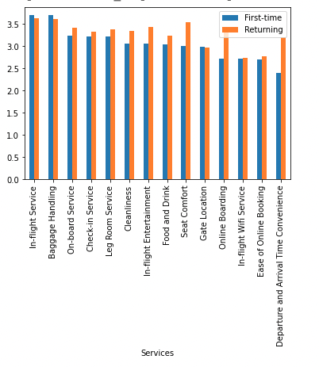

## Maven-Airline-Data-analysis
 #mavenairlineschallenge is a challenge Organized by [Maven Analytics](https://www.mavenanalytics.io)

## Task
 The task of this challenge is to recommend a data-driven strategy for increasing Maven Airlines' satisfaction rate.
 

## EDA
I have done EDA on the Maven Airline dataset, here is what I have found 👇
1. On average, Most satisfied service of Maven Airline is In-flight Service. 
The Least satisfied service is In-flight Wifi

2. Flight distance can affects types of class chosen by customers. 
For long distance flight (over 3000 miles) almost all passengers are in Business class

3. There is no obvious correlation in Age and Satisfaction score, but old people tends to have higher score than younger people.

4. First time and returning customers have very different satisfaction score.
Top 3 services most difference satisfaction score betweeen first time and returning customers:
- Departure and Arrivial Time Convenience
- Online Boarding
- Seat Location   

[Data source](https://mavenanalytics.io/data-playground)

## Dashboard

[dashboard](./Dashboard.pdf)

[Link to Tableau Public](https://public.tableau.com/views/Maven-Airline/Dashboard1?:language=en-GB&:display_count=n&:origin=viz_share_link)

## Recommendation

- Upgrade Wifi in airplane, In the data we can see that our returning customers are unhappy about Wifi in plane, first time customers also have similar disatisfaction.
- Improve Online Booking system for better user experience, both first time and returnin..
- Increase choice of time slot, our first time customers are not satisfied with current time slot of depart and arrive. Provide more time slot can improve satisfaction and increase return rate in future.